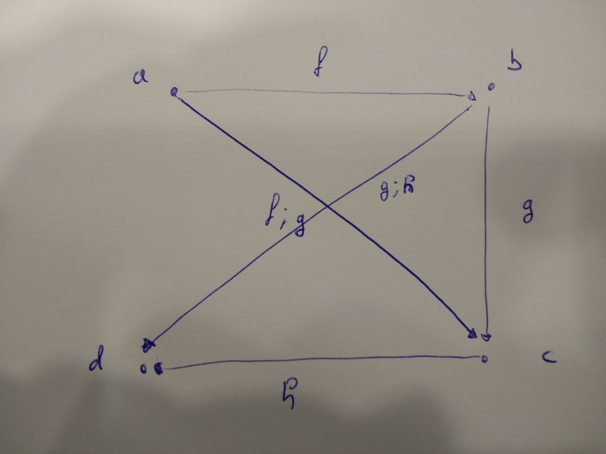
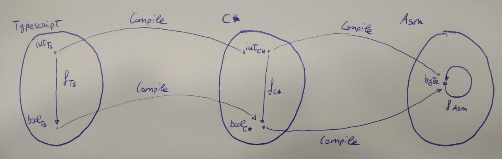

# Introduction

## Category theory and programming

Category theory is a branch of mathematics whose goal is to express things in terms of objects and their transformations or mappings, independently of their structural characterization. This branch is particularly relevant for Software Engineering to measure the "goodness" of a library. Usually, when you want to know whether the implementation of a library is good or not, you find very fuzzy and subjective guidelines. These can be classified (but not limited to) in the following way\:

1. __Goodness by anecdote__\: In several occasions, unfortunately also in books that claim to be about software engineering, you find guidelines whose justification is based on personal experience of the author, so you find this pages-long tales about when he was a young and inexperienced programmer and then he saw this code that was written in that particular way and everything in his professional life became so much better from that moment on. This is very similar to what prophets do to attract more followers to their cult.

2. __Goodness by size__\: In many divulgative software engineering books, you often see long chapters that talk about the code goodness in terms of lines of code. In short they state\: "size matters". Very often the conclusion is that a good size is a small size. Usually this statement does not sound very convincing and for some people it might also sound counter\-intuitive. For example, programs written in functional languages generally spread along the width and not the height of the page, while imperative languages usually spread along the height of the page a lot more. So let us imagine that I have a method in C\# that is 50 lines long (usually this is considered bad), and then I decide to port it to F\# and it becomes a two\-liner. What does this mean? Is it good now only because it is shorter? It does not sound so convincing\: a method that was poorly written in C# magically becomes good in F# only because the language I am using is more synthetic.

3. __Goodness by reponsibility__\: A good guideline for software engineering is that functions should do "one thing". Although this is reasonable, it is quite arbitrary to decide what "one thing" means. Does it mean that I cannot compose functions in a single function? For example, if I need to make coffee, I need to grind the beans, warm up the water, and then mix the pouder with the hot water and finally the coffee is ready. So If I write a function `makeCoffe()` and inside I compose `grind().then(warm().then(pour()))` is it a bad function because it is doing three things together? And what about higher order functions, so functions that take other functions as input? Are they bad because they are capable of doing infinitely many things?

4. __Goodness by readability__\: Another guideline is that your code should be "readable". The problem is that the idea of what "readability" is might be quite subjective. For example, you find that for many a readable program is a program that has descriptive names for variables, methods, classes, etc. Although this can be generally accepted, sometimes it is quite difficult to find a suitable name when the function is really abstract. For example, if you recall the function `let bind = <a,b>(m: Monad<a>, f: (_: a) => Monad<b>): Monad<b>`, what would a descriptive name for the function `f` be? It can literally be anything\! Does this mean that mondas are an example of bad code? Moreover, a further readabiliy "metric" (between quotes, because it really is not a unit of measure), is that the code should follow a top\-down narrative, so you should be able to descend through the program and, just by reading it, understand what happens. And what about concurrent programs? By definition, when you have multiple threads, you do not follow a top\-down behaviour and the order of execution can be completely arbitrary. So no concurrent programming should ever be attempted?

This list could go on forever, but the important thing is understanding that these guidelines are just guidelines, and as such they are not very reliable and they are very subjective. What we are looking for is a way of characterizing objectively the properties of the code that we are writing, in a rigorous way so that every one of us can agree on that without diverging. In this course we choose to do so by using category theory. We do not claim this is THE way of achieving the result, as there are several other software quality metrics that are well-defined and used. We just claim this is ONE powerful way of doing so.

## Categories

In category theory we want to be able to express things only in term of transformations and their properties, regardless of the underlying structure. Indeed for most of the time we will be showing ways of transforming "things" into other "things" but we will never enter in the details of how these things are built concretely, if not to show examples.

To explain what a category is, we use a metaphore\: we can imagine a category as a map where we mark locations, and the roads to go from a source location to a target location. So let us consider the following map (taken from Jan Charvát's map of Magnamund)\:


In this map we can identify mainly locations and roads (although there are other elements such as mountains, forests, seas, etc.). It is possible to travel from one location to another through roads. For example I can travel from Toran to Holmgard. Roads can also be used in sequence, or composed together, to reach farther destinations. For example, I can reach Ragadorn using the road from Toran to Holmgard and then the one from Holmgard to Ragadorn. Then I can safely say that it is possible to reach Ragadorn from Toran.

Categories are drawn similarly to maps, with the difference that we use dots for objects and arrows for their connections. As a syntactical convention, we use lower\-case letters to give names to objects, like $a,b,c,...$ We use capital letters to denote the name of a category, like $C, D, E, ...$ An arrow (also called morphism) also has a name written with lower\-case letters, but we also denote the source object and the target object, as in $f: a \rightarrow b$. This means that morphism $f$ has source $a$ and target $b$. Note that it is possible that there are isolated objects, thus with no incoming or outgoing morphisms. A concrete example could be the following diagram:


However, there are some constraints that must be met in order to have a category. The first one is that, if I have three objects $a,b,c$ and two morphisms $f: a \rightarrow b$ and $g: b \rightarrow c$, then it is possible to compose them into a single morphism, such that $f;g: a \rightarrow c$. The composition $f;g$ reads as "$f$ then $g$". Sometimes, in most traditional maths texts, the alternative notation $g \circ f$ is used, which reads as "$g$ after $f$". Of course usually it is more convenient to read from left to right so we mostly use $f;g$.


Note that the morphism $f;g$ is dashed because it is not directly defined, rather it has the same effect as using the morphism $f$ and then $g$ in this order. In general we will draw a dashed morphism to denote a morphism that is built from others instead of being primitively given in the category.

The second constraint is that, for each object, there is always a morphism called "identity" where the source and the target are the same object, that is, $\forall \text{ object } a, \exists id_a: a \rightarrow a$. The identity has the property that, if composed with another morphism, the composition coincides with the morphism itself. In other words we have that, given two morphisms $f:b \rightarrow a$ and $g: a \rightarrow c$, $f;id_a = f$ and $id_a;g = g$


The third and last constraint is the associative property of the morphism composition. This states that, given three morphisms $f: a \rightarrow b$, $g: b \rightarrow c$, and $h: c \rightarrow d$, then $(f;g);h = f;(g;h)$. In other words, it does not matter whether I compose first $f$ and $g$, and then compose the resulting morphism with $h$, or first compose $g$ and $h$, and then compose it after $f$. The diagram below represents this equivalence graphically\:



For convenience, we summarize everything said so far about categories in the following definition\:

### Category

A category $C$ is made of a collection of objects $\lbrace a,b,c,... \rbrace$ called $Obj(C)$ and a collection of morhpisms or arrows called $hom(C)$ that connect a source object to a target object, such that:

1. $\forall f,g \in hom(C) | f: a \rightarrow b,g: b \rightarrow c, \exists f;g \in hom(C) | f;g: a \rightarrow c$ (or $g \circ f: a \rightarrow c$). (_composition_)
2. $\forall x \in Obj(c), f: a \rightarrow x, g: x \rightarrow b, \text{  } \exists id_x \in hom(C) | f;id_x = f \text{ } \text{ and } id_x;g = g$ (_existence of identity_)
3. $\forall f,g,h \in hom(C) | f: a \rightarrow b, g: b \rightarrow c, h: c \rightarrow d$ we have that $(f;g);h = f;(g;h)$. (_associativity of the composition_)

### Commutative diagrams

We want to emphasize an additional property of diagrams\: if we look back at the diagram used to describe the associativity of the morphism composition, we can see that, if I choose as source the element $a$ and as endpoint the element $d$, then all the possible paths that I can take from $a$ always lead to $d$. The same applies for $b$ as source with the same endpoint\: whatever path I choose from $b$, this will always result in $d$. Informally, we say that a diagram is _commutative_ or that it _commutes_ if, foreach pair of objects $(x,y)$ it is possible to reach $y$ using all the paths starting from $x$.

## Example of Categories

One category that we always use in our profession, without being aware of doing it, is the category of programming languages. In this category the objects are types and the morphisms are the functions. Indeed a function takes as input a value of a certain type and returns, in general, a value of a different type.

The composition in this category is simply the function composition seen in Software Engineering 1.

```
let then = <a, b, c>(f: (x: a) => b, g: (x: b) => c): ((x: a) => c) => {...}
```

This function, as previously seen, is associative. Indeed `then(then(f, g), h) = then(f, then(g, h))`.
We also know that we can define a generic identity function for any type, which is

```
let id = <a>() : ((_: a) => a) => (x: a) => x
```


Note that, in the picture above, we have different ways to go from one object to the other. For example we can use the morphism $(float)$ (cast to float) and then use $ToString$ for $float$ to get to $string$, or we can directly call $ToString$ for $int$. Moreover, note that not all morphisms that go from one object to itself are the identity. For example, for $bool$ we have the identity $id_{bool}$, but we also have the $not$ operator. Of course those are two different morphisms.

Another category that we use a lot is the one of natural numbers. Natural numbers and their operations are taught since elementary school, but they are a category. This category contains only one object (that we call $N$) and infinite morphisms. Each morphism is used to represent a number, for example $+0, +1, +2, ..., +k$. The function composition is used, for instance, to implement the sum. Indeed if we use $+1;+5$, it is like following directly $+6$. With not much surprise, this composition is associative: $(+1;+5);+3 = +1;(+5;+3)$, which is the same as saying that $(1 + 5) + 3 = 1 + (5 + 3)$ with the usual notation. This category is summed up in the following diagram


# Epimorphisms, monomorphisms, isomorphisms
In the previous lesson we have seen what a category is and what its properties are. In this lesson we focus instead on relevant properties of morphisms and their behaviour in presence or absence of such properties. We try to tackle the subject from a more "traditional" and intuitive point of view and then we generalize it in the field of category theory. We then introduce the new concept of _Functor_ that allows us to define transformations between two categories.

## Functions

_Function_ is a very important and ubiquitous abstraction of programming languages. The concept of function derives from the homonymous concept from mathematics. In mathematics a function is simply a transformation that maps elements from a set A (_domain_) into other elements of a set B (_codomain_), with the constraint that an element of the domain cannot be mapped to more than one elements of the codomain. This is not very different from what we do in programming: a function usually takes as input a number of arguments and returns a value.

### Example

In the following function

```
let pow = (base : number, exponent : number) : number => 
  exponent == 0 ? 1 : base * pow(base, exponent - 1)
```

the domain is the set of pairs of `number`, or `Tuple<number, number>` and the codomain is `number`. For every possible input of this function we have only one possible result. It never happens that a function returns two different results for the same input, although it is possible that for two different inputs you return the same output.

We now focus on properties of functions. Given that in category theory objects have no structure, and only morphisms somehow characterize the structure of the category, we will attemt to study all we can about morphisms in terms of *how they compose with other morphisms*.

## Surjective Functions and Epimorhpisms

 _Surjectivity_ is a property of functions that informally defines whether the codomain is wholly used or if some of its elements are never returned by the function. Let us try to represent this with pictures. The following function is __not surjective__:


As you can see, the element $b_4$ of the codomain is not returned as output of any element of the domain. On the other hand the following function __is surjective__, since all elements of the codomain are output of an element of the domain.


In general a function $f: A \rightarrow B$ is surjective when $\forall y \in B \text{   } \exists x \in A | y = f(x)$

This means that for each element in the codomain $y$ there is an element in the domain $x$ such that calling the function $f$ with input $x$ returns $y$.

### Example

The function

```
let square = (x : number) : number => x * x
```
is not surjective. Indeed negative numbers are never returned by such a function, because the square of a number is always positive.

Morphisms of categories can, when composed in a certain way, exhibit a property that is analogous to surjectivity for functions. At this purpose, let us consider two morphisms $f$ and $g$ where $f \neq g$ and let us consider the following diagram:


Note that $f$ and $g$ differ in the fact that the source of $f$ is $b_2$ and the target is $c_2$ while with $g$ the source is $b_2$ and the target is $c_3$. Now we add an additional morphism $h$ before applying $f$ and $g$. Notice that $h$ never has the element $b_2$ as target so it is not surjective. Now if we do $h;f$ the result is

\begin{array}{l}
a_1 \rightarrow c_1\\
a_2 \rightarrow c_3\\
a_3 \rightarrow c_4\\
\end{array}

while if we do $h;g$ we get

\begin{array}{l}
a_1 \rightarrow c_1\\
a_2 \rightarrow c_3\\
a_3 \rightarrow c_4\\
\end{array}

$h;f$ and $h;g$ have the same sources and targets because the only elements that would lead to a different target by applying $h;f$ and $h;g$ is never a target of $h$. So when a morphism is not surjective, it might happen that the composition with other morphisms maps the same objects. From this observation we can give the following definition:

### Epimorhpism (1)
A morphism $s$ is surjective (also called _epimorphism_) iff $\exists f,g | f \neq g \text{  then  } s;f \neq s;g$

This means that if I can find two morphisms $f$ and $g$ that are different, then $s$ is surjective if the composition of $s$ with such morphisms maps different objects. An equivalent formulation is the following:

### Epimorphism (2)
A morphism $s$ is surjective (also called _epimorphism_) iff $\forall f,g | s;f = s;g \text{  then  } f = g$

This means that a morphism $s$ is surjective if and only if, for all possible pairs of morphisms $f$ and $g$ that I can define, then if it happens that the composition of $s$ with such morphisms leads to the same result, then it must necessarily happen that $f$ and $g$ are the same morphism.

The word "epimorphism" means "over the shape/structure" (from the Greek epí \= over and morphé \= shape), indeed through $f$ we can cover completely the objects we map to (there is none left over).

## Injective Functions and Monomorphisms

Analogously to what we have just done for surjection, let us start with a discussion about injective functions and then generalize it to morphisms in category theory. We saw in the previous section that some functions might not generate a set of results that covers completely all the allowed results in the codomain, i.e. some elements of the codomain are never returned by the functions (calling the function with any possible input will never return them). It is possible though, that a surjective function returns the same result for two different inputs. Such a function is __not injective__. Informally, we say that a function is injective if any element of the co-domain is mapped from at most one element of the domain. This is equivalent to saying that it is not possible to return the same result with two different inputs to the function.


Another possible interpretation of a function that is not injective can be given by looking at the diagram above: we notice that the function does not collapse elements into a single one in the domain. So, for functions that are not injective, it is not possible to determine what input was given to them by looking at their result. We now present the formal definition of an injective function

### Injective Function (1)

A function $f: A \rightarrow B$ is injective iff $\forall x,y \in A | x \neq y \text{ then } f(x) \neq f(y)$

This says that, for all pair of __different__ inputs $x$ and $y$ that I can choose, applying the function $f$ to them always leads to a different result. This definition can be expressed in an equivalent way as follows:

### Injective Function (2)

A function $f : A \rightarrow B$ is injective iff $f(x) = f(y) \text { then } x = y$

This means that, if at some point I notice that the function generates the same result, then it must have been necessarily generated by calling the function with the same input.

### Example

The function

```
let listOption =  <a>(opt : Option<a>): List<a> => {...}
```

that creates an empty list if the input is `None`, or a list with an element if the input is `Some` is injective, because it is not possible that for two different options you output the same list.

Now let us move to the scope of category theory and let us consider the diagram below\:


We can see that morphism $h$ is not injective, since it maps objects $b_1$ and $b_2$ into $c_1$. We also notice that, in this case, $f;h = g;h$, thus we can say that, when a morphism $h$ is not injective, I can find two different morphisms $f$ and $g$ that, if composed with $h$, lead to the same object. Thus, we can formulate the following definition for injective morphism

### Monomorphism (1)
A morphism $i$ is injective (also called _monomorphism_) iff $\forall f,g | f \neq g \text{  then  } f;i \neq g;i$

This means that, when a morphism $i$ is injective, for all __different__ pairs of morphisms that I can choose in my category the result of their composition with $i$ always leads to different objects. An equivalent formulation of this definition is the following:

### Monomorphism (2)
A morphism $i$ is injective (also called _monomorphism_) iff $\forall f,g | f;i = g;i \text{  then  } f = g$

This means that, if at any point I compose two morphisms with an injective morphism and I observe that I got to the same object, then it must necessarily be that the two morphisms that I used in the composition with $i$ coincide.

The word "monomorphism" literally means "single shape" (from the Greek monos \= one and morphé \= shape) and this is indeed how monomorphisms behave\: one object can only be "shaped" through $f$ in only one way.

## Bijective functions and Isomorphisms

Informally a bijective function is a function that creates a one\-to\-one mapping with __all__ the elements of the codomain, as shown in the picture below\:


By observing the picture we can notice the following properties:

1. All elements in the codomain are used.
2. An element of the domain is mapped to one and only one element in the codomain.

We can immediately notice that the first remark is the definition of surjective function, and the second is the definition of injective function. Thus we can immediately give the following definition:

### Bijective function
A function $f$ is bijective if and only if it is both surjective and injective.

### Example

The identity function

```
let id = <a>(x : a) : a => x
```
is (with not much surprise) bijective. Indeed all the elements of `a` can be returned as result of the function, and the function never returns the same result for two different inputs.

Now, let us try to analyse the same situation with categories by looking at the following diagram\:


If I compose the morphism $f;g$ and I start from $a_1$, I get back to $a_1$. On the other hand if I compose $g;f$ and I start from $b_1$ I go back to $b_1$. This means that $f;g = id_{a_1}$ and $g;f = id_{b_1}$. From this we can give the following definition:

### Isomorphism

A morphism $f: a \rightarrow b$ is an isomorphism if $\exists g: b \rightarrow a | f;g = id_a \text{  and  } g;f = id_b$

The word "isomorphism" means "the same shape" (from the Greek isos \= same and morphé \= shape), indeed a one-to-one correspondence is just a "renaming" of objects, so a way of calling the same thing in two different ways.

Note that, in the context of category theory, an isomorphism is not equivalent to a a morphism that is at the same time monomorphism and epimorphism.

## Functors

Up to this point, we have seen how to connect objects of the __same__ category, but would it be possible to connect together objects from different categories? The answer is yes and these connections are called _functors_. More precisely, a functor maps objects and morphisms from one category to another. However, the way the functor maps objects and morphisms is not just random and it has to respect some properties. Let us first check intuitively what these properties could be.


From the picture above, we can see that the functor $F$ maps object $a$ from category $C$ into an object $F(a)$ in category $D$. The same applies to $b$ and $c$ that become in turn $F(b)$ and $F(c)$. Analogously, the morphism $f$ in $C$ is mapped to a morphism $F(f)$ in $D$. Now let us take a look to the composition $f;g$\: this morphism maps $a$ to $c$ in category $C$. Since $F$ maps $a$ in $F(a)$ and $c$ in $F(c)$, we have that $F(f;g): F(a) \rightarrow F(c)$. Moreover $f: a \rightarrow b$, so $F(f): F(a) \rightarrow F(b)$, and $g: b \rightarrow c$, so $F(g): F(b) \rightarrow F(c)$. Now what happens if, instead of first composing directly $f$ and $g$ and the mapping the composition into category $D$ through $F$, we first map individually each morphism and then compose them together in $D$? Let us take a look\: from the picture and the considerations above, we concluded that $F(f): F(a) \rightarrow F(b)$ and $F(g): F(b) \rightarrow F(c)$. Thus their composition $F(f);F(g): F(a) \rightarrow F(c)$. But we note that this is the same as $F(f;g)$. So our first property should be that $F(f;g) = F(f);F(g)$. This means that composing two morphisms in category $C$ and then mapping them into $D$ through the functor $F$ is the same as first mapping each individual morphism into $D$ through the functor $F$ and __then__ composing the corresponding morphisms of $D$ together. This is the essential property of a functor.

Now let us take a look at the identity\: $id_a$ maps an object $a$ in $C$ to itself, so $id_a: a \rightarrow a$. Again, the functor $F$ maps $a$ in $C$ into $F(a)$ in $D$. Thus the morphism corresponding to $id_a$ in $D$ will be $F(id_a): F(a) \rightarrow F(a)$. Furthermore, the identity of $F(a)$ in category $D$, maps the object $F(a)$ to itself, and $id_{F(a)}: F(a) \rightarrow F(a)$. But then we expect it to be the same morphism of $F(id_a)$. Our second property is then that $F(id_a) = id_{F(a)}$. This means that mapping the identity of $a$ in $C$ through $F$ results into the identity of the mapped element of $a$ through $F$ in $D$, which is $id_{F(a)}$.

We can then formalize all these considerations in the following definition:

### Functor

Given two categories $C$ and $D$, a _functor_ is a transformation from $C$ to $D$, $F: C \rightarrow D$ such that\:

1. $F(id_a) = id_{F(a)}$ (_identity law_)
2. $F(f;g) = F(f);F(g)$ (_distributive property of the composition_)

### Types and Endofunctors

Let us consider a function $f: a \rightarrow b$ and the category of types of a programming language, then the type constructor $List$ is a functor. We now show how: we know that the functor $List$ should map a type $a$ in the type $List(a)$ and a type $b$ in the type $List(b)$. This transformation is called _endofunctor_ (from the Greek endon \= inner), since it maps objects of a category into the same category, in this case objects of the category of types of a programming language into the same category. Then it follows that $List(f): List(a) \rightarrow List(b)$. The attentive reader should have already noticed that this type definition corresponds to the `map` function seen in Software Engineering 1. Moreover if we consider two functions $f: a \rightarrow b$ and $g: b \rightarrow c$ then $List(f): List(a) \rightarrow List(b)$, $List(g): List(b) \rightarrow List(c)$ and thus $List(f;g): List(a) \rightarrow List(c)$. Furthermore, $List(f);List(g): List(a) \rightarrow List(c)$, thus we have that $List(f);List(g) = List(f;g)$.

As for the identity, $id_a: a \rightarrow a$ is transformed with functor $List$ into $List(id_a): List(a) \rightarrow List(a)$. But we also have that $id_{List(a)}: List(a) \rightarrow List(a)$, so we can conclude that $List(id_a) = id_{List(a)}$. This is like saying that mapping the identity of a type $a$ through $List$ leads to the same result as applying directly the identity with the type $List(a)$.

### Example

If we consider the functions

```
let isPos = (x: number) => bool {...}
let incr = (x: number) => number {...}
```
and we apply the functor $List$, we have that $List(incr): List(number) \rightarrow List(number)$ and $List(isPos): List(int) -> List(bool)$. This is equivalent to `List.map(incr)` and `List.map(isPos)`. If we take the list `l = [-1;1;3;-5]` and we call `List.map(incr).then(List.map(isPos)).f(l)`, then first we increase by 1 all the elements of the list, obtaining `l1 = [0;2;4;-4]` and then we check if they are positive obtaining `l2 = [false;true;true;false]`. If we do the composition first, and then use it in `map` we have the same result (we call `List.map(incr.then(isPos)).f(l)`)\: the composition is a function that first increases a number by 1 and then check if it is positive. Thus the first element of `l` would first become 0, and then the test returns `false`. The same applies to all the other elements, and we have as result `[false;true;true;false]` again. This shows that `List.map(f.then(g)) = List.map(f).then(List.map(g))`

Moreover, if we use the identity function with the list `l`, `id<List<number>>().f(l)`, this results into the same list `[-1;1;3;-5]`. If we use `List.map(id<number>()).f(l)`, we apply the identity function to each element of the list, thus first we map each element to itself and then we return the list, obtaining again `[-1;1;3;-5]`.

### Importance of functor properties

As we informally saw in Software Engineering 1, the properties of a functor are not simply abstract formalities, but they can be used in practice to optimize the code. For instance, we saw that the distributive property can be used to optimize the code performance, since generally $F(f;g)$ is faster than $F(f);F(g)$. We saw this in the scope of the functor $Option$\: its `map` function contains an `if-then-else` in this code that checks if we are dealing with `None` or `Some` and acts accordingly. If we use `Option.map(f).then(Option.map(g))` we evaluate the choice twice, while knowing beforehand that it will yield the same result, as `Option.map(f.then(g))` preserves the structure and only changes the content. On the other hand, if we call `Option.map(f.then(g))` we do this only once but obtain the same result. This optimization is very relevant when composing together a large number of functions. Moreover, we know that `id<Option<a>>() = Option.map(id<a>())`. Of course the left call is faster than the second, because the first might directly return the reference to its argument, while the second creates a copy of it after inspecting its structure. This example is even more relevant in the context of $List$\: calling `map` with the identity as argument creates a copy of the input list containing the same elements.


Some compilers that support functors as language abstractions (like Haskell) can use these properties to perform code optimizations\: they can automatically transform `map(f).then(map(g))` into `map(f.then(g))` and `map(id<a>())` into `id<F<a>>()`, so a programmer does not have to worry that one version is faster than the other and remember to use it.

### Functor composition

One of the first property of categories is the capability of composing things, namely of composing morphisms. Functors can be composed as well. For example, going back to the category of types and considering the functors $List$ and $Option$, we can compose them together to create, for instance, the type `List<Option<a>>`. This is equivalent to applying the functor $List$ __after__ the functor $Option$. What we are trying to do is $List \circ Option$ (Remember that $\circ$ takes the arguments in the opposite order of ; and we read it "$List$ after $Option$").

Now let us consider, as usual, a morphism $f: a \rightarrow b$, and let us apply the functors in order: $Option(f): Option(a) \rightarrow Option(b)$. Now if we apply the functor $List$ to this result we have that $List(Option(f)): List(Option(a)) \rightarrow List(Option(b))$. This means that $List(Option(f)): List(Option(a)) \rightarrow List(Option(b))$. This means that, if I have $Option$ and $List$ already implemented, I can compose `Option.map` with `List.map` withouth having to implement an ad\-hoc map for the composite functor $List \circ Option$. The composition of functors thus allows us to re\-use code that we have already implemented. This is a very important aspect, because a good software engineering practice is modularity and code re\-usage.

We do not cover this in detail, but another property of functor composition is that it is associative, namely if $F,G,H$ are functors, we have that $F \circ (G \circ H) = (F \circ G) \circ H$. Furtermore, if we consider the functor $I$ such that $I(f) = f$ and $I(a) = a$, we have that, for any pair of functors $(F,G)$, $F \circ I_d = F$ and $I_c \circ G = G$.

Since composition of functors has both the associative and identity property, we can conclude that functors are morphisms between categories, and then that categories themselves form their own category.


# Natural transformations

## Functors and compilers

In the previous lesson we explored the concept of _functor_ as a way to map objects and morphisms from one category to another. As examples connected with programming languages, we have considered functors that map objects and morphism of the category of types in programming languages to itself. We called these _endofunctors_. For instance, the following diagram shows the functor $Option$ that maps each type $a$ into another type $Option(a)$. 

We also saw that functors are not just random maps between one category to the other, but in order to be well defined, they must resepct two properties: the identity property, and the distributive property. The first one ensures that the functor correctly transforms the idenity of the first category into the identity of the second category. The second one ensures that the composition property of morphisms is resepected also by their transformations. Consider indeed the diagram below:


and the function $isPositive: int \rightarrow bool$. The functor $Option$ maps the type $int$ into $Option(int)$, $bool$ into $Option(bool)$, and the morphism $isPositive$ into $Option(isPositive)$. We saw that $Option(isPositive)$ is nothing more than the function `map_Option(isPositive)` that we used in Software Engineering 1.

Another interpretation of functors is the following\: let us consider the category of types in the language Typescript, and the one of C\#. We can define a transformation from the category of types of Typescript in that of C\#. This transformation is a functor, but what is it in practice? It is a compiler\! One of the steps performed by a compiler is translating the types of a programming language into the types of a target programming language. The translation might (and often does\!) lose information and structure\: If the language is untyped, like assembly, we can imagine its category of types having only one element. Let us call this functor $Compile$. The identity law says, for instance, that $ Compile(id_{int_{Typescript}}) = id_{int_{C\#}}$. This means that, if we compile the identity function, mapping an integer number in Typescript to itself, in C\# the result will be the identity function in C\# that maps an integer number in C\# to itself. 

Now let us thing about the distributive property of the function composition. This property ensures that, given two functions written in Typescript, $Compile(f_{Typescript};g_{Typescript}) = Compile(f_{Typescript});Compile(g_{Typescript})$. This means that I can first compose two functions directly in Typescript and hen compile them, or I can compile them individually and the assemble them in C\#. But to what part of a compiler does this correspond? This is simply the capability of defining functions in different files that can be assembled together. I can put both functions in the same file (left part) and then compile a single file, or I can put the functions in separate files that are compiled individually and then assembled together in C\#\: their behaviour remains the same\!

We saw at the end of the last lesson that functors are composable and there exists an identity functor, so categories are objects of a category of their own. In the scope of compilers, composing the $Compile$ functor means that we can define intermediate compilation steps. Intermediate compilation is a technique that is actually used in compilers, that usually do not translate immediately to the target language and instead compile first to an intermediate representation. It also means that, if for instance I have a compiler that translates from C to Assembly and I want to compile Typescript to Assembly, I can simply compile Typescript into C (which might be easier) and then use the compiler of C directly:

$Compile_{Ts,Asm}(f_{Ts}: a_{Ts} \rightarrow b_{Ts}) =  Compile_{Ts,C}(f_{Ts}: a_{Ts} \rightarrow b_{Ts});Compile_{C,Asm}(f_C: Compile_{Ts,C}(a) \rightarrow Compile_{Ts,C}(b))$



## Functors and natural transformations

At the end of the last lesson we showed how functors are morphisms in the category of categories. The identity of this category is the identity functor $Id(a) = a$, where $Id(f: a \rightarrow b) = f$. Functors are also composable, and one example was shown in the previous section. We now try to do a further abstraction step and try to see if it is possible to define transformations between functors, like we did previously for categories. 

Let us consider the function $head$. A possible implementation of this function in Typescript would be:

```
type List<a> = {
  kind: "Empty"
} | {
  kind: "Cons"
  head: a
  tail: List<a>
}

let head = <a>(l: List<a>): Option<a> => 
  (l.kind == "Empty") ? None<a>() : Some<a>(l.head)
```

This transformation clearly goes from a functor to another functor, since we can also simply write its definition as $head: List \Rightarrow Option$. Now let us consider the diagram below:


Now if we start from the functor $List$ and we apply immediately $head$ we have

$List(a) \overbrace{\Rightarrow}^{head(a)} Option(a)$

and then we can apply the functor $Option$ to the result

$Option(a) \overbrace{\rightarrow}^{Option(f)} Option(b)$

On the other hand we can also choose to first apply the functor $List$ obtaining

$List(a) \overbrace{\rightarrow}^{List(f)} List(b)$

and then call the functor transformation $head$ on the result

$List(b) \overbrace{\Rightarrow}^{head(b)} Option(b)$

We can now conclude that, if we have a morphism $f: a \rightarrow b$

$head(a);Option(f) = List(f);head(b)$

Note that the first approach is faster, since applying $head$ immediately discards all the elements of a list but the first, and the the function $f$ is applied only to that single element, while in the other case we apply $f$ to all the elements and only at the end we keep only the first one. This is also another optimization equality\!

### Example

If we consider the function $isPositive: number \rightarrow boolean$ we have the following diagram:


We have the following equivalences:

$[1,-2,3] \overbrace{\Rightarrow}^{head(number)} Some(1) \overbrace{\rightarrow}^{isPositive} Some(true)$.

$[1,-2,3] \overbrace{\rightarrow}^{List(isPositive)} [true;false;true] \overbrace{\Rightarrow}^{head(boolean)} Some(true)$

We now formalize this kind of transformations on functors and their properties in the following way:

### Natural transformation

Given two functors $F:C \rightarrow D$ and $G: C \rightarrow D$, we say that $\eta: F \Rightarrow G$ is a _natural transformation_ if $\eta_x$ is, for each object $x$ in $D$, a morphism $\eta_x: F(x) \rightarrow D(x)$, such that $\eta_a;G(f) = F(f);\eta_b$.


This property is also called "mapping morphisms to diagrams", as the natural transformation transforms a morphism into a whole diagram, as exemplified in the picture below


## Composition of natural transformations

Natural transformations can be composed as well and we will show that right away. For brevity, we shorten the name of the functors $List$ and $Option$ in $L$ and $O$. Also the natural transformation $head$ will become simply $h$. Let us also consider the natural transformation $OptionToList$, that converts `None` into the empty list and `Some(x)` into the list `[x]`. We call this natural transformation $Ol$ for brevity. The following is the composite diagram for the natural transformations:


We see that we can go from $L(a)$ to $L(b)$ in different ways\: for example we can use $h(a);Ol(a);L(f)$ or we can use $L(f);h(b);Ol(b)$. The first composition is faster because at the first step we get rid of all the elements but the first from the list and then the function $f$ is applied only to a list with one element, while we the other path $f$ is applied to the whole list, then we keep only the first element and finally we convert the list to an option.

Now if we consider three functors $F$, $G$, and $H$, all mapping objects and morphisms from the same category $C$ to $D$, and two natural transformations $\eta: F \rightarrow G$ and $\varepsilon: G \rightarrow H$, we can conclude, from what we saw in the commutative diagram, that there exists their composition $\eta;\varepsilon: F \Rightarrow H$. This means that natural transformations are morphisms between functors.

Clearly there exists an identity natural transformation that maps each functor to itself. Thus, the functors between two given categories $C$ and $D$ are objects, with natural transformations as morphisms of a new category.


## Forward and backward transformations

Let us consider the case where we use the natural transformation `head` as argument of `map_List`. Since `head: List<a> => Option<a>` and `map_List: ((_: a) => b) => List<a> => List<b>` then `map_List(head): List<List<a>> => List<Option<a>>`. Using the category theory notation, we have that $List \; head: List \circ List \Rightarrow List \circ Option$. In general given three functors $H$, $F$, and $G$, and a natural transformation $\eta$, then there exists a natural transformation $H\eta$, called _forward transformation_, such that

$H \eta: H \circ F \Rightarrow H \circ G$

Note that this natural transformation is transforming a composition of functors, which is itself a functor since functors are morphisms between categories, into a different composition of functors.

Now, let us consider the inverse, that is we call `head` with `List<a>`. Then `head` called with `List<a>` has type `List<List<a>> => Option<List<a>>`. Using the categorical notation we have that $head \; List: List \circ List \Rightarrow Option \circ List$. In general, given three functors $F$, $G$, and $K$, there exists a natural transformation $\eta K$ called _backward transformation_, such that

$\eta K: F \circ K \Rightarrow G \circ K$

These natural transformations will be particularly helpful when applied to monoidal endofunctors, as we will see immediately in the next unit.


# Monoidal endofunctors
In the previous unit we have studied the properties of natural transformations, that are transformations between functors. We showed that it is possible to compose natural transformations through a _vertical composition_ and that this composition is associative. Moreover, we stated that there exists an identity transformation that maps a functor to itself. This allowed us to conclude that functors are a category where the morphisms are natural transformations. In this unit we will explore how to equip particular kinds of functors with additional structure.

## Monoid

In this section we refresh the definition of the algebraic structure __monoid__ that will be strongly connected with what we will do later. Informally a monoid is a set that supports a internal binary operation that is associative and has an identity for that operation. An internal binary operation is any function that takes as input a pair of elements from the set and returns an element __in the same set__.

### Example

Natural numbers equipped with the sum operation are a monoid. Indeed, as we all know, the sum operation is associative, that is, $(x + y) + z = x + (y + z)$. Moreover, there exists a natural number 0, such that $x + 0 = 0 + x = x$.

### Example

Strings with the concatenation operation (that we call \+ also in this context) are monoid. The concatenation is associative, that is, if $s1$, $s2$, and $s2$ are different strings, we have that $(s1 + s2) + s3 = s1 + (s2 + s3)$. Moreover, the empty string is the identity of the concatenation operation, indeed $s1 + "" = s1 = "" + s1$.

Formally we can define a monoid as follows (note that $m^2 = m \times m$ corresponds to the cartesian product of the set with itself):

### Monoid
A monoid is a set $m$ with the following functions\:

$\eta: () \rightarrow m$

$\mu: m^2 \rightarrow m$

having the following properties\:

$\mu(x, \mu(y, z)) = \mu(\mu(x, y), z)$ (associativity)

$\mu(x, \eta()) = x = \mu(\eta(), x)$ (identity)

Note that $\eta$ is the "lazy" formulation of the identity element, as it is a constant function that does not take any arguments and returns the identity element.

What we want to do now, is to transpose the concept of monoid in the scope of category theory and, more precisely, to the scope of functors. In short, we want to give functors the structure of a monoid.

## Monoidal Functors

The monoidal structure can be given only for a special class of functors that is the class of _endofunctors_. Informally an endofunctor is a functor that transforms a category into itself (do not confuse it with the identity functor, not all endofunctors are identical\!). The formal definition of a monoidal endofunctor is the following:

### Monoidal Endofunctors
An endofunctor $M: C \rightarrow C$ is a _monoidal endofunctor_ or _monad_ if it has two natural transformations $\eta: I \Rightarrow M$ and $\mu: M^2 \Rightarrow M$ that satisfy the following properties (we use $id_M$ to denote the identical natural transformation for the endofunctor $M$):

1. $M\eta;\mu = \eta M;\mu = id_M$ (identity)

2. $M\mu;\mu = \mu M;\mu$ (associativity)

Note that $M^2 = M \circ M$. The natural transformation $\eta$ is also known as _unit_ or _return_ and it is simply a constructor for the monoidal functor, that takes an element of a type $a$ and boxes it into $M$. The natural transformation $\mu$ is called _join_ or _flatten_.

### Examples
If we take the functor $Option$ then $\eta$ is defined as\:

$\eta: I \Rightarrow Option$

```
let unitOption = <a>(x: Id<a>): Option<a> => ({
  kind: "some",
  value: x
})
```

remember that the identity functor is `type I<a> = a`. Moreover,

$\mu: Option^2 \Rightarrow Option$

```
let joinOption = <a>(o: Option<Option<a>>): Option<a> =>
  o.kind == "none" ? ({ kind: "none" }) : ({ kind: "some", value: o.value })
```

For the functor $List$, $\eta$ is the function `singleton` that encapsulates a single element into a list with a single element.

```
let singleton = <a>(x: Id<a>): List<a> => { ... }
```
while the functor $\mu$ is the function `flatten` that groups all the elements of the sub-lists of a list of lists into a single list:

```
let flatten = <a>(l: List<List<a>>): List<a> => { ... }
```

## Monoid Properties of Functors

In this section we show that the identity and associativity property of the natural transformations of monoidal endofunctors are well\-formed, that is that the equalities are indeed equalities. We do a validity check on the definition we gave to see if it makes sense. A first observation is that $M\eta$, $\eta M$, $\mu M$, and $M\mu$ are meaningful composition since they are forward and backward compositions of natural transformations, that we have already explored in the previous unit.

At this point we analyse the equality in the identity property\: the left\-hand side of the equality contains

$M\eta;\mu$

$M\eta$ is equivalent to applying the `map` of functor $M$ passing as input function the natural transformation $\eta$. Recalling that

```
let map_M = <a, b>(f: (x: a) => b): Fun<M<a>, M<b>>
```
if we call `map_M` with `unit` (which is $\eta$) as argument we have the following mapping for the generics

```
a ---> Id<a>
b ---> M<a>
```
thus the type returned by `map_M(unit)` is `Fun<M<a>, M<M<a>>>`, which, in the categorical notation, becomes $M\eta: M \Rightarrow M \circ M = M ^2$. At this point, if we simply apply $\mu$, by definition $\mu: M^2 \Rightarrow M$. Thus we have that $M\eta; \mu = M$.

Now, let us consider the right\-hand side of the identity property, that is 

$\eta M;\mu$

if we call `unit` with an argument of type `M<a>`, then the generic `a` is mapped to `M<a>`, thus the type returned by it is `M<M<a>>`. In out categorical notation we have that $\eta M: M \Rightarrow M^2$. At this point we can use again $\mu$ that by definition is $\mu: M^2 \Rightarrow M$, thus obtaining $M$ again. From this we can conclude that $\eta M;\mu = M$. At this point we proved that $M\eta;\mu = \eta M;\mu$. Also we know that $M\eta;\mu: M \Rightarrow M$ and $\eta M;\mu: M \Rightarrow M$, thus $M\eta;\mu = Id_M$ and $\eta M;\mu = Id_M$. 

The commutative diagram of this property is shown below.


### Example

If we consider the $List$ functor and we start from the list `[1,2]` then when we apply $List \; \eta$ we obtain `[[1],[2]]`. Indeed each element of the list `[1,2]` is boxed through `unit` in a singleton list and the `map` returns a list of singletons. After this we use $\mu$, which, in the case of $List$, corresponds to `flatten` that simply combines all the elements from the sub\-lists into a single list, thus `[[1],[2]] => [1,2]`. On the other hand, if we first use $\eta \; List$ we box the input list into another list, thus obtaining `[[1,2]]`. After this, we use $\mu$ that flattens the list. Flattening a list containing only one sub\-list is equivalent to just outputting the inner list, thus `[[1,2]] => [1,2]`. 

This example is drawn in the diagram below.


At this point we verify the equalities in the associative property. We start by verifying $M\mu;\mu$. If we call `map` with the function `join` then the generics are instantiated as follows:

```
a ---> M<M<a>>
b ---> M<a>
```
thus the type of `map(join)` is `M<M<M<a>>> => M<M<a>>`. In the categorical formulation we can write that $M\mu: M^3 \Rightarrow M^2$. If we then apply $\mu$ again, by definition, $\mu: M^2 \Rightarrow M$, thus $M\mu;\mu: M^3 \Rightarrow M$.

We now check the right\-hand side of the associative property. If we apply $\mu M$ than the generic `a` is instantiated with `M<a>`, thus the type of `join<M<a>>` is `M<M<M<a>>> => M<M<a>>`, which in the categorical notation becomes $\mu M: M^3 \Rightarrow M^2$. If we now call $\mu$ again by definition $\mu: M^2 \Rightarrow M$, thus $\mu M;\mu: M^3 \Rightarrow M$. At this point we can conclude that $M\mu;\mu = \mu M;\mu$. 

This proof is shown in the commutative diagram below.


### Example
If we consider again the functor $List$ and for $List^3$ we consider `[[[1,2],[3]], [[4]]]`, then applying $M\mu$ flattens `[[[1,2],[3]],[4]]` and [[4]] into two lists of lists, thus obtaining `[[1,2,3],[4]]`. Finally calling $\mu$ flattens the sub-lists into one list leading to `[1,2,3,4]`. On the other hand, if we first apply $\mu M$, we flattent the $List^3$ into $List^2$ thus obtaining `[[1,2],[3],[4]]`. We then apply $\mu$ again that flattens this result even further leading to `[1,2,3,4]`. 

This process is shown in the diagram below. 


At this point, to connect this formulation of monads to the more traditional formulation of functional programming, we can define an utility function called `then` or `bind`\:

`let then = (m: M<a>, f: (x: a) => M<b>): M<b> => map_M(f).then(join_M()).f(m)`

Indeed calling the type of `map_M(f)` is `M<a> => M<M<b>>` and then calling `join_M` with its result has type `M<M<b>> => M<b>`.

The presence of this operator is ubiquitous in all libraries that exhibit a monadic structure, such as Linq that is essentially a list monad where `bind` is called `selectMany` or sometimes `flatMap`.

After these considerations, the well\-known quote _"A monad is just a monoid in the category of endofunctors. What is the problem?"_ should appear as a trivial statement for the reader and not a problem at all.


# Bi-cartesian Closed Categories
## Bi-cartesian closed categories

In the previous unit we saw how to give the structure of monoid to a specific kind of functors, that is the one of endofunctors, so functors that map a category into the same category. We called such endofunctors monoidal endofunctors or simpy monads. In this final unit we instead try to define operations between elements of a category. We will see that it is possible to express products, sums, and exponentials of objects in a category.

#### Product

Let us consider three objects $a$, $b$, and $c$ of a category. Let us also assume that there exists a morphism $f: c \rightarrow a$ and $g: c \rightarrow b$. We want to be able to express the product $a \times b$. In order to do so, let us consider this from the point of view of the category of types of a programming language, and let us assume that those objects are types in this category. The product of types corresponds to the type

```
interface Product<a, b> {
  a: a,
  b: b
}
```

An intuitive consideration is that, since `Product` is simply a data structure that combines together two values of different types, it should always be possible to retrieve the single elements of type `a` and `b` from this product. This means that, if I have a way of obtaining `a` by using a function `f` that takes an input a different type `c`, and, in the sameway, a function `g` from `c` to `b` (note that this type is in general different from both `a` and `b`), I should also be able to construct `Product<a, b>` from `c` and then retrieve the single elements from the pair through two different functions from `Pair<a, b>` to `a` and from `Pair<a, b>` to `b`.

Now let us try to translate this in the more general domain of categories. We said that we have morphisms $f: c \rightarrow a$ and $g: c \rightarrow b$. Let us also assume that we have a morphism $\langle f,g \rangle: c \rightarrow a \times b$ that constructs the product. According to our considerations, we should always be able to extract the single elements from the product, so we need two morphisms $\pi_1: a \times b \rightarrow a$ and $\pi_2: a \times b \rightarrow b$. At this point, starting from object $c$ it should be possible to reach object $a$ by using directly $f$ or by composing $\langle f,g \rangle;\pi_1$. In the same way, using directly $g$ should lead to the same result of $\langle f,g \rangle;\pi_2$. This is summerized by the following properties and the commutative diagram below:

$f = \langle f,g \rangle;\pi_1$

$g = \langle f,g \rangle;\pi_2$


Going back to the category of types in a programming language, the product constructor can be built as\:

```
let mkProd = <a, b, c>(f: (x: c) => a, g: (x: c) => b): 
  ((x: c) => Product<a, b>) => (x: c) => ({
  a: f(x),
  b: g(x)
})
```

So we need the morphism $f$ and $g$ (in this case functions) to get `a` and `b` that are later stored in the product. The type `c` can be used to pass arguments to the constructor. The implementations of the functions $\pi_1$ and $\pi_2$ are immediate and left to the reader.

Now if we want to transform $a \times b$ into a different product $a' \times b'$, we need two morphisms $h: a \rightarrow  a'$ and $l: b \rightarrow b'$. Moreover, we need a morphism $h \times l: a \times b \rightarrow a' \times b'$. Clearly, the following equalities must hold:

$\pi_1;h = h \times l;\pi_1$

$\pi_2;l = h \times l;\pi_2$

The morphism $h \times l$ is a bi\-functor, and we have previously seen it in Software Engineering 1 as\:

```
let map2 = <a, a1, b, b1>(h: (x: a) => a1, l:(x: b) => b1): 
  ((x: Product<a, b>) => Product<a1, b1>) => (p: Product<a, b>) => ({
  a: h(p.a),
  b: l(p.b)
})
```
The following commutative diagram summarizes these considerations\:


From this bi\-functor we can create its left and right functor, where left and right marks the variable object while the other is kept
fixed. This is done by using $h \times id_b$ and $id_a \times l$. These functors are respectively denoted as $-\times b$ and $a \times -$ The following diagrams show these transformations.


Note that the morphisms $\pi_1$ and $\pi_2$ are actually natural transformations\:

$\pi_1: - \times b \Rightarrow I$

$\pi_2: a \times - \Rightarrow I$

A category where we can define a product of objects satisying the properties discussed so far is called _cartesian category_.

#### Sum of objects

The sum of objects  is an object that contains either $a$ or $b$. In the category of types of a programming language this can be implemented as a discriminated union where each case contains one element of type $a$ and the other of type $b$. For example in typescript we have

```
type Either<a, b> = {
  kind: "left"
  value: a
} | {
  kind: "right"
  value: b
}
```
Now let us consider three objects of a category $a$, $b$, and $r$ and two morphisms $f: a \rightarrow r$ and $g: b \rightarrow r$. Going from $a$ or $b$ to $r$ using these two morphisms should be equivalent to building the sum $a + b$ through a morhpism starting from either $a$ or $b$ (of course we would need two different morhpisms) and then applying a morphism from $a + b$ to $r.$. We then define the following morphisms:

$\iota_1: a \rightarrow a + b$

$\iota_2: b \rightarrow a + b$

In the domain of the category of types of a programming language, these morphisms are the functions _injection left_ and _injection right_\:

```
let inl = (x: a): Either<a, b> => ({
  kind: "left",
  value: x
})

let inr = (x: b): Either<a, b> => ({
  kind: "right",
  value: x
})
```

We then define a morphism $[f,g]: a + b \rightarrow r$, so that we are able to take a sum and reach the object $r$. At this point, the following equivalences must hold\:

$f = \iota_1;[f,g]$

$g = \iota_2;[f,g]$

These equivalences are depicted in the diagram below\:


Now let us assume that we want to define a morphism to go from $a + b$ into $a' + b'$. We need a morphism $h: a \rightarrow a'$ and another morphism $l: b \rightarrow b'$. We then define a morphism $h + l: a + b \rightarrow a' + b'$. At this point the following equalities hold:

$h;\iota_1 = \iota_1;h + l$

$l;\iota_2 = \iota_2;h + l$

This is shown in the diagram below\:


The morphism $h + l$ is also a bi\-functor. It is possible to derive its left and right functors as well, denoted as $- + b$ and $a + -$. The following diagrams show how to derive these functors\:


Also in this case $\iota_1$ and $\iota_2$ are natural transformations\:

$\iota_1: I \Rightarrow - + b$

$\iota_2: I \Rightarrow a + -$

A category with both the product and the sum is called _bi-cartesian category_.

#### Algebraic properties of object operations

In this section we show that object operations in a category exhibit the same properties as operations between numbers. For this section we need to introduce two additional concepts:

1. In a category $C$ we define the _initial object_ or $0$ an object such that $\forall \text{ object } a \text{ in } C \; \exists \; f: 0 \rightarrow a$.
2. In a category $C$ we define the _terminal object_ or $1$ an object such that $\forall \text{ object } a \text{ in } C \; \exists \; f: a \rightarrow 1$.

In Haskell type system, the initial object is the type called `void` while in Typescript is called `never`. In Typescript we have a function `absurd: never => a`. Of course the type `never` can never be instantiated, nor can the function `absurd` be invoked.

In typescript the terminal object is the empty record `{}` while in Haskell, F\#, Caml, ..., it is called `unit`. There exists a function `ignore: unit => a` thet simply discards the input value and returns `unit`.
 
Armed with this new tools, we start showing that

$a \times b = b \times a$

In order to prove this, we need to show the existance of the following morhpisms:
1. $a \times b \rightarrow b \times a$.
2. $ b \times a \rightarrow a \times b$.

At this point, we know that there exists two natural transformations $\pi_1$ and $\pi_2$ that extracts respectively the first and second element from the product. Thus if we want to invert the element of the pair we simply extract the elements with $\pi_1$ and $\pi_2$ and then build a pair with $\pi_2$ and $\pi_1$, that is

$i= \langle \pi_2,\pi_1\rangle$

The opposite can be costructed in an analogouse way with

$j = \langle \pi_2,\pi_1 \rangle$

The diagram below shows a graphical representation of this equivalence\:


At this point we can also prove that, as we expect, the following equalities hold\:

1. $a \times 1 = a$
2. $a \times 0 = 0$

For the first one we must prove that we the following morhpsims exist\:

1. $i: a \times 1 \rightarrow a$
2. $j: a \rightarrow a \times 1$

For the first one we start from a product and we have to keep only the first element of that product. We already have a morphism that does this, which is $\pi_1$. So $i = \pi_1$. For the second one we start from an object $a$ and we must obtain a product between that object and the terminal object. In this case we can use the product constructor where the first argument is the identity of $a$, $id_a: a \rightarrow a$, and the second must be a morphism from $a$ to $1$. But this function always exists by definition of terminal object and it is called `unit`. So we have that $j = \langle id_a, \text{ignore}\rangle$.

Now for $a \times 0 = 0$ we have to prove that there exist two morphisms $i: a\times 0 \rightarrow 0$ and $j: 0 \rightarrow a \times 0$. For the first one we can simply use $\pi_2$ to extract 0 from the product, thus $i = \pi_2$. For the second one we need a way to generate a product between $a$ and $0$ from $0$. In order to obtain $a$ from $0$ we just need to use `absurd` in the pair constructor as first argument, while to go from 0 to 0 we can use $id_0$ or `absurd` again, thus $j = \langle \text{absurd},id_0\rangle$ or $j = \langle \text{absurd},\text{absurd}\rangle$.

As for the properties of the sum, we prove that

$a + b = b + a$

In order to do so, we have to show that there exist two morphisms $i: a + b \rightarrow b + a$ and $j: b + a \rightarrow a + b$. We need to find two morphisms $f: a \rightarrow b + a$ and $g: b \rightarrow b + a$. We know that for the sum there exist the natural transformations $\iota_1: I \Rightarrow - + b$ and $\iota_2: I \Rightarrow a + -$, and that $[f,g]: a + b \rightarrow r$. In our case $r = b + a$ (which is the result that we want to obtain), thus we can call the sum constructor with $\iota_2$ and $\iota_1$ to build the new sum with the exchanged element. We thus obtain that $i = [\iota_2,\iota_1]$ This construction is shown in the diagram below\:


The morphism $j$ is obtained in the same way, thus $j = [\iota_2,\iota_1]$. For the sum we also have that $a + 0 = a$, thus we need to show that there exist two morphisms $i: a + 0 \rightarrow a$ and $j: a \rightarrow a + 0$. For the first one we need to get $a$ from $a + 0$, thus we need to use the sum constructor with a morphism from $a$ to $a$ and one from $0$ to $a$. The first one is clearly $id_a$ while the second is `absurd`. Thus $i = [id_a,\text{absurd}]$. For $j$ we have to obtain $a + 0$ from $a$, so this is immediate as it is exactly $\iota_1$. Indeed we do not care what the second element is, as $\iota_1$ always construct $a + b$ where the variable part is the left one, thus $j = \iota_1$. In typescript such function would have type `a => Either<a,never>`.

#### Exponential of objects

The exponential $b^a$ denotes the objects of the category of morphisms $f: a \rightarrow b$. We have already shown in the unit about Natural Transformations that morphisms are indeed a category where the natural transformations are the arrows. The exponentiation notation is used to have a connection with the cardinality (amount of possible outcomes) that a morphism can have. For instance, consider $(a + b)^{(a + b)}$, for each possible source there can be two possible destinations. Since there are two possible sources we have in total $2 \times 2 = 4$ possible destinations.

A relevant morphism that manipulates objects of the category of morhpisms is called $\Lambda: c \rightarrow b^a$. If we consider a morphism $g: c \times a \rightarrow b$ then $\Lambda(g)$ takes as input this morphism and returns $b^a$. In functional programming this morphism is known as the higher\-order function `curry`\:

```
let curry = <a, b, c>(g: (p:Product<c, a>) => b) => 
  (x: c): ((y: b) => a) => {...}
```
Now let us suppose that we have a morpism $eval:b^a \times a \rightarrow b$. In programming `eval` is a function that accepts a function from $a$ to $b$ and a value of type $a$ and calls the input function returint its result.

```
let eval = <a, b>(f: Product<a => b, a>,x: a): b => f(x)
```

At this point, we should be able to go from $c \times a$ to $b$ by using directly $g$ or by combining $eval$ and $\Lambda$. Let us see how\: we can go from $c \times a$ to $b^a \times a$ by applying the pair constructor with $\Lambda$ as first argument and $id_a$ as second argument. In this way we have $\langle \Lambda(g),id_a \rangle: c \times a \rightarrow b^a \times a$. At this point we can apply $eval: b^a \times a \rightarrow b$. We have then that $g = \Lambda(g);eval$. If we think about this in terms of functional programming, if we apply `curry` with a function that takes $c \times a$, this returns the curried version of that function that is able to accpet the arguments of type $c$ and $a$ separately, indeed $\Lambda(g): c \rightarrow b^a$. At this point $eval$ is a function that is able to evaluate a function given its input, so we get $b$. This equality is shown in the diagram below\:


At this point we can prove the last and most complex algebraic property, that is the distributive property\:

$a \times (b + c) = a \times b + a \times c$

In order to prove this, we split our construction in multiple steps.

### Step 1 

We prove that the following morphisms exist:

1. $m: b \rightarrow (a \times b + a \times c)^a$
2. $n: c \rightarrow (a \times b + a \times c)^a$

In order to do so, we try to build first a morphism from $a \times b \rightarrow a \times b + a \times c$. This can simply be done with $\iota_1$, since we are taking the left argument of the sum and we inject it into the sum itself. At this point if we define $swap: a \times b \rightarrow b \times a$ (we have already proved that this morphism exists and is $\langle \pi_2,\pi_1 \rangle$) and we apply it before $\iota_1$ we get

$swap;\iota_1: b \times a \rightarrow a \times b + a \times c$

Finally, if now we use $\Lambda(swap;\iota_1)$ we get $b \rightarrow (a \times b + a \times c)^a$. Indeed $\Lambda$ takes a morphism $g: c\times a \rightarrow b$ and goes from $c \rightarrow b^a$, so basically the effect is that we take the second element of the product in $g$ and we place it as exponent in the right\-hand side. In our particular situation we start from $b \times a \rightarrow a \times b + a \times c$ and we use $\Lambda$ to move $a$ to the right\-hand side $a \times b + a \times c$ as exponent. So $m = \Lambda(swap;inl)$. The morphism $n$ is constructed analogously as $n = \Lambda(swap;inr)$.

### Step 2
We show that there exists a morphism $a \times (b + c) \rightarrow a \times (a \times b + a \times c)^a$. Since we know that $m: b \rightarrow (a \times b + a \times c)^a$ and $n: c \rightarrow (a \times b + a \times c)^a$ by definition $[m,n]: b + c \rightarrow (a \times b + a \times c)^a$ (refer to the diagram of the sum). Now to create the product with the $a$ in first position we just combine the identity of $a$ and $[m,n]$ in the product constructor so we have that $\langle id_a,[m,n] \rangle:a \times (b + c) \rightarrow a \times (a \times b + a \times c)^a$.

### Step 3
At this point we know from the algebraic properties of the product that $a \times (a \times b + a \times c)^a = (a \times b + a \times c)^a \times a$. At this point we can use $eval: (a \times b + a \times c)^a \times a \rightarrow a \times b + a \times c$.

#### Closure notes
 A category equipped with product, sum, and exponentiation is called _bi\-cartesian closed category_. This categories are very powerful and they can express very complex mechanisms such as exception handling, stateful computations, and processes that can fail as algebraic transformations of objects in the category of types of a programming language.

#### Option

The `Option` simply becomes a sum between $a$ and $1$, so that we have $Option \equiv a + 1$. Indeed, in Software Engineering 1, we had defined `Opption<a>` as `Sum<a,Unit>` (we called the sum `Either`).

#### State monad

The State can be defined as $(a \times s)^s$, indeed in Software Engineering 1 we defined `State<s, a> = (x: s) => Product<a, s>`

#### Process monad

A Process that can fail can be defined as $(a \times s + 1)^s$, indeed in Software Engineering 1 we defined `Process<s, a> = (x: s) => Sum<Product<a, s>, Unit>`.

All these libraries can be expressed as composition of operations in a category, thus the number of new complex structures that we can define in bi-carthesian closed categories is virtually unlimited.

